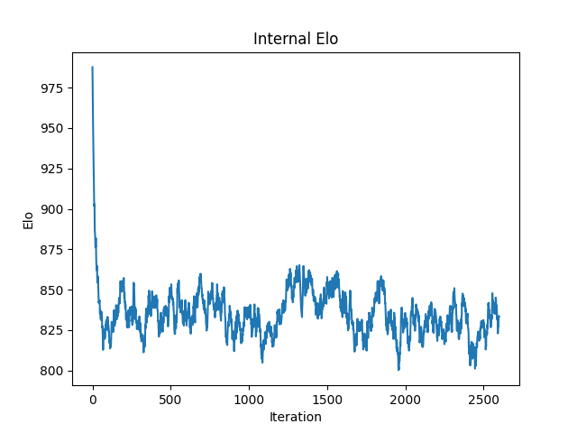
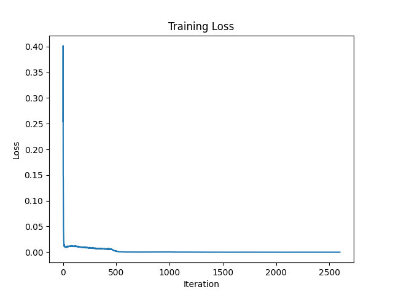
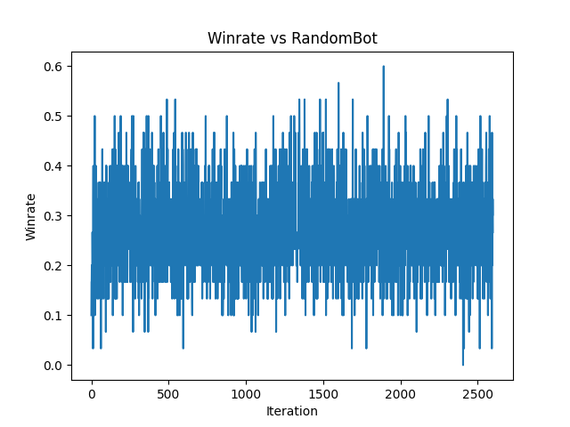
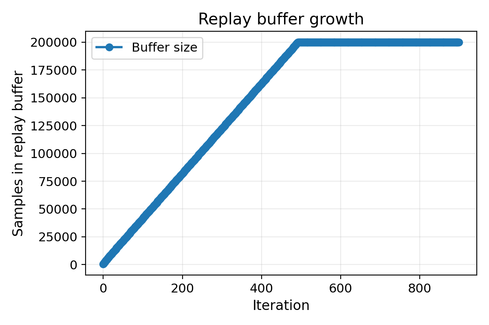
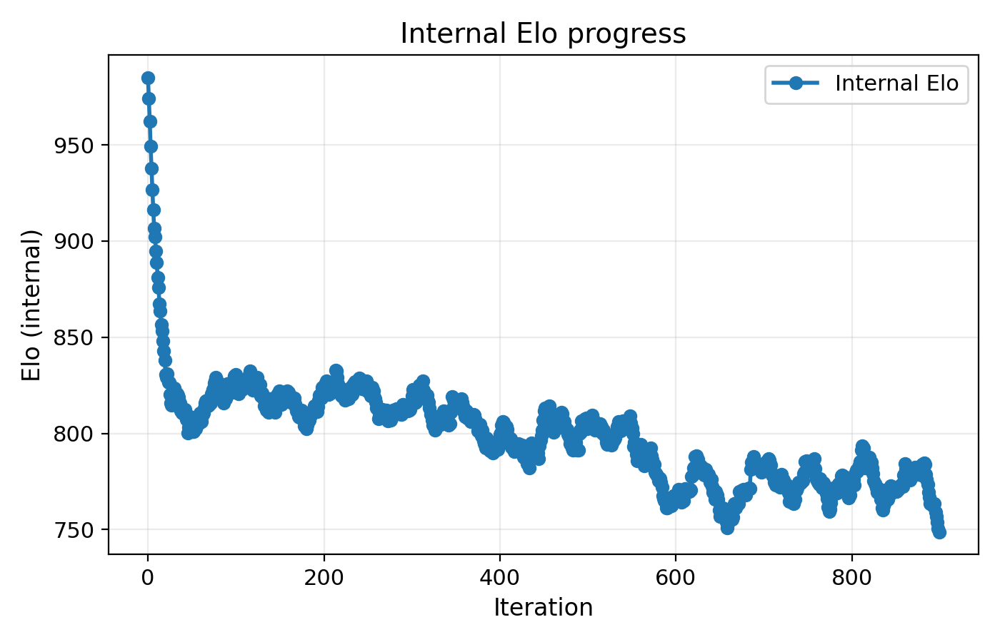
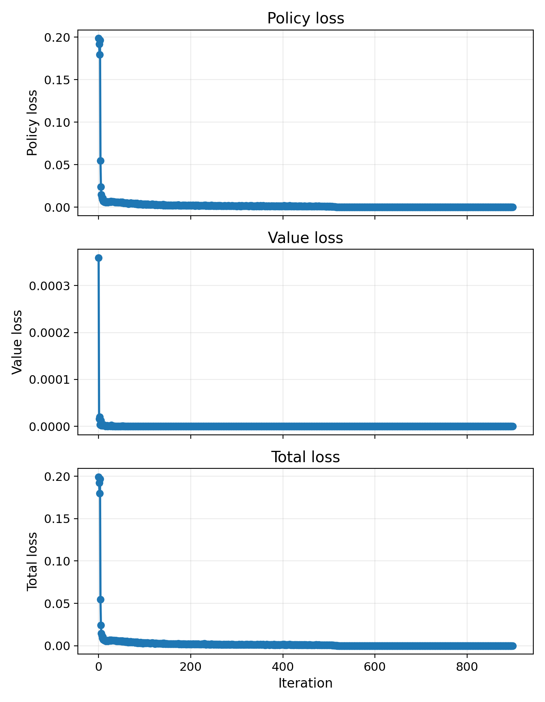
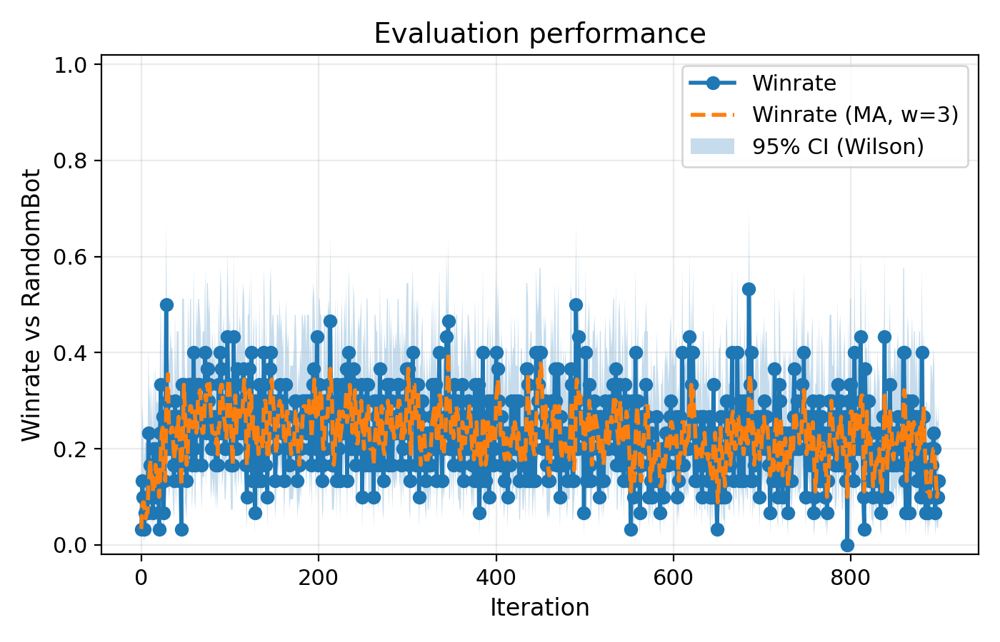

# rbc-selfplay

Master's Thesis – University of Turin

Search-guided self-play learning for Reconnaissance Blind Chess (RBC), a partially observable chess variant implemented with the reconchess framework.

This repository contains code developed for a Master's thesis on reinforcement learning under partial observability using an AlphaZero-inspired training pipeline.

Main components include:

- belief-state modeling for hidden opponent pieces
- entropy-based sensing
- greedy determinization
- neural network policy/value evaluation
- root-only PUCT search
- iterative self-play training
- evaluation against baseline RBC bots

## Repository structure

.
├── src/                      # Modular RBC implementation
├── notebooks/                # Development notebook
├── rbc_selfplay.py           # Integrated experimental version used on Benko
├── run_long_training.py      # Training configuration AZ40
├── run_long_training_mcts80.py # Training configuration AZ80
├── eval_rbc_bots.py          # Final evaluation matches
├── make_eval_plot.py         # Evaluation plotting utility
├── make_elo_table.py         # Elo table generation
├── play_local.py             # Local match test
├── train.py                  # Modular training entrypoint
└── plots.py                  # Plot utilities

## Training configurations

Two main configurations were used.

### AZ40

- 40 MCTS simulations
- 4 self-play games per iteration
- 200 training steps per iteration
- batch size 64

Run with:

python run_long_training.py

### AZ80

- 80 MCTS simulations
- same remaining parameters

Run with:

python run_long_training_mcts80.py

## Evaluation

Evaluation matches can be run with:

python eval_rbc_bots.py

These include:

- AZ40 vs AttackerBot
- AZ80 vs AttackerBot
- AZ40 vs AZ80

## Setup

Install dependencies:

pip install -r requirements.txt

## Notes

Large training artifacts such as checkpoints, logs and run folders are excluded from version control using .gitignore.

The repository includes both the modular implementation (`src/`) and the integrated experimental script used during development (`rbc_selfplay.py`).


## Training Results

### AZ40 Training

Elo progression:



Training loss:



Win rate:



---

### AZ80 Training

Buffer size during training:



Elo progression:



Training loss:



Win rate:



## Final Evaluation Results

The final evaluation was performed on 50 games per matchup.

| Matchup | Wins | Losses | Draws |
|---|---:|---:|---:|
| AZ40 vs AttackerBot | 0 | 1 | 49 |
| AZ80 vs AttackerBot | 0 | 0 | 50 |
| AZ40 vs AZ80 | 0 | 0 | 50 |

These results show that both trained agents produced a very high number of draws under the standard RBC move limit, and that increasing the self-play search budget from 40 to 80 simulations did not produce a measurable improvement in final match outcomes.

## Agent Overview

The overall decision pipeline is:

```text
Belief State
    ↓
Feature Tensor (15×8×8)
    ↓
Policy / Value Network
    ↓
Root PUCT Search
    ↓
Selected Move

## License

See LICENSE.
